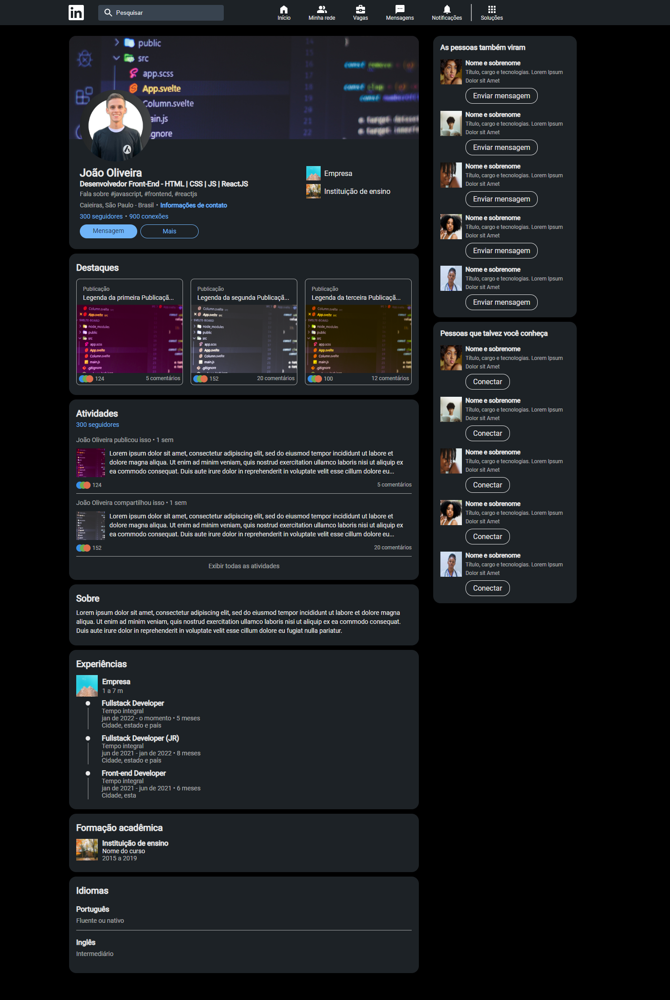

# LinkedIn (7 Days of Code)

A minha versão da página de perfil do LinkedIn foi desenvolvida durante o desafio 7 Days of Code criado pela Alura.

O design do projeto foi disponibilizado através do Figma, e tive como desafio reproduzir o layout em código, utilizando HTML e CSS.

## 🛠️ Tecnologias

- HTML
- CSS

## 💙 Contato

joaoliveira.batista1@gmail.com
